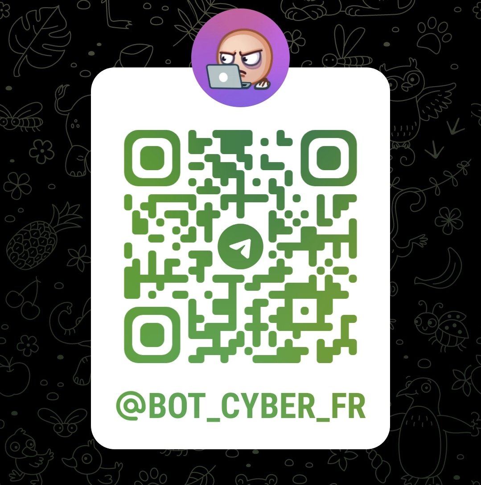

# Cyber Bot

Cyber Bot is an open-source Node.js project that helps users enhance their cybersecurity skills through automated Telegram messages. The bot runs on a VPS (OVH) and leverages Mistral AI to generate cybersecurity-related content.

Want to see it in action? Join our Telegram channel: [@bot_cyber_fr](https://t.me/bot_cyber_fr)

## Features

- **Daily TryHackMe Reminders**

```
npm run cron -- -c sendTHM
```

- **AI-Enhanced Study Notes** - Sends curated notes from a GitHub repository, enhanced by Mistral AI

```
npm run cron -- -c sendGithubNotes
```

- **Cybersecurity News Digest** - Aggregates and summarizes news from our [curated RSS feed](https://raw.githubusercontent.com/kOaDT/cyber-bot/refs/heads/develop/assets/CyberSecurityRSS.opml)

```
npm run cron -- -c sendNewsResume
```

- **Darknet Diaries Summaries** - Provides summaries of the latest [Darknet Diaries](https://darknetdiaries.com/) podcast episodes

```
npm run cron -- -c sendDarknetDiariesResume
```

- **YouTube Channel Updates** - Summarizes the latest videos from specified channels

```
npm run cron -- -c sendYoutubeResume -y https://www.youtube.com/[channel-name]
```

- **Curated YouTube Shorts** - Shares relevant short-form videos based on customizable parameters (search period, queries, and blacklisted terms). Configure settings in the `sendShort.js` script.

```
npm run cron -- -c sendShort
```

## Setup Guide

### Prerequisites

- Node.js
- Telegram Bot Token (obtain via [BotFather](https://t.me/BotFather))
- Mistral AI API Key ([Register here](https://mistral.ai/))
- VPS (recommended)

### Installation

1. Clone and initialize the repository:

```sh
git clone git@github.com:kOaDT/cyber-bot.git
cd cyber-bot

# Create tracking files
mkdir -p assets
touch assets/processedArticles.json    # News tracking
touch assets/lastProcessedDD.json      # Darknet Diaries tracking
touch assets/lastProcessedYt.json      # YouTube tracking
touch assets/processedShorts.json      # Shorts tracking
```

2. Install dependencies:

```sh
npm install
```

3. Configure environment variables in `.env`:

```env
# GitHub Settings
GITHUB_SECRET=
GITHUB_USERNAME=
GITHUB_REPO=
# Optional
EXCLUDED_GITHUB_FILES=

# Telegram Settings
TELEGRAM_BOT_TOKEN=
CHAT_ID=
# Optional Topic IDs for message organization
TELEGRAM_TOPIC_THM=
TELEGRAM_TOPIC_NEWS=
TELEGRAM_TOPIC_YOUTUBE=
TELEGRAM_TOPIC_DARKNET=
TELEGRAM_TOPIC_GITHUB=

# Mistral AI Settings
MISTRAL_API_KEY=
# Optional, comma-separated
AUTHORIZED_LANGUAGES=

# YouTube Settings
YOUTUBE_API_KEY=
```

4. Optional: Customize Mistral AI parameters in `/crons/config/mistral.js`

5. Optional: Modify bot prompts in `/crons/utils/prompts`

## Usage

Run any feature using:

```sh
npm run cron -- -c <CRON_NAME>
```

Specify content language (if authorized):

```sh
npm run cron -- -c <CRON_NAME> -l <language>
```

Note: Content language is restricted by the `AUTHORIZED_LANGUAGES` environment variable to avoid prompt injection. Default is English.

## Deployment

For VPS deployment guidance, visit: [Deploy Your Own Cron Jobs Server on a VPS](https://www.caleb-tech.blog/blog/deploy-your-own-cron-jobs-server-on-a-vps-in-9-simple-steps/)

## Contributing

Contributions are welcome! Feel free to:

- Report issues
- Submit pull requests
- Suggest new features

## License

UNLICENSED - This project is released into the public domain.


